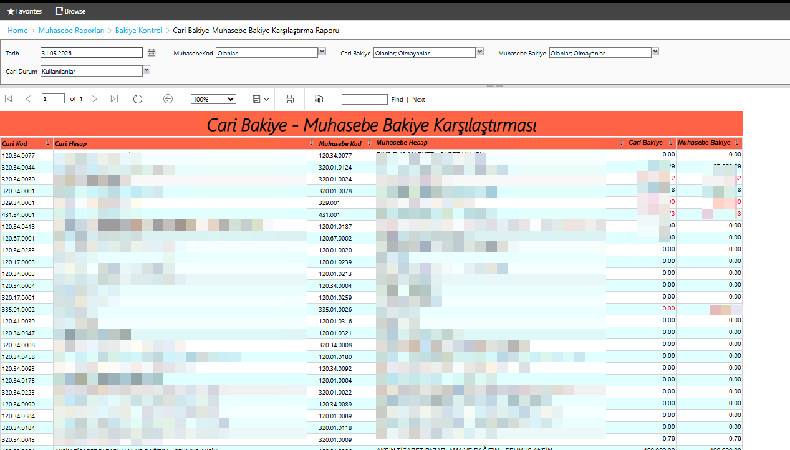

# Cari Bakiye - Muhasebe Bakiye Karşılaştırma Raporu

Logo Tiger ERP'de cari modüldeki bakiye ile muhasebe modülündeki bağlı hesabın bakiyesini yan yana karşılaştıran SSRS raporu. Muhasebe entegrasyon kontrolü ve tutarsızlık tespiti için kullanılır.

## Önizleme

## Özellikler

- Cari bakiye ile muhasebe bakiyesini aynı satırda karşılaştırma
- Tutarsızlık olan satırları renk ile vurgulama
- Çoklu filtre desteği
- Belirli bir tarihe göre bakiye hesaplama

## Parametreler

| Parametre | Açıklama |
|-----------|----------|
| Tarih | Bakiye hesaplama tarihi |
| MuhasebeKod | Muhasebe hesap kodu filtresi |
| Cari Bakiye | Cari bakiye filtresi (Olanlar / Olmayanlar) |
| Muhasebe Bakiye | Muhasebe bakiye filtresi (Olanlar / Olmayanlar) |
| Cari Durum | Aktif / Pasif / Kullanılanlar |

## Sütunlar

| Sütun | Açıklama |
|-------|----------|
| Cari Kod | Logo Tiger cari kart kodu |
| Cari Hesap | Cari hesap ünvanı |
| Muhasebe Kod | Bağlı muhasebe hesap kodu |
| Muhasebe Hesap | Muhasebe hesap adı |
| Cari Bakiye | Cari modüldeki bakiye |
| Muhasebe Bakiye | Muhasebe modülündeki bakiye |

## Kullanım Amacı

- Dönem sonu muhasebe mutabakatı
- Cari-muhasebe entegrasyon kontrolü
- Tutarsız kayıtların tespiti
- Denetim hazırlığı

## Ortam

- **ERP:** Logo Tiger 3
- **Raporlama:** SSRS (SQL Server Reporting Services)
- **Veritabanı:** SQL Server
