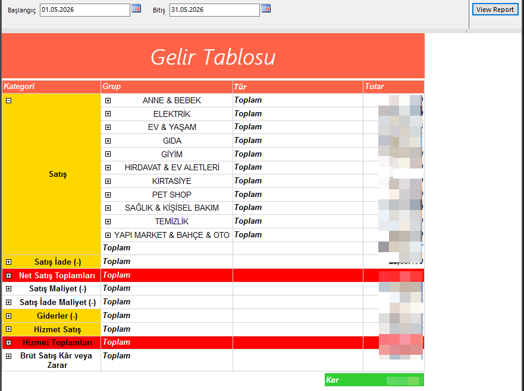

# Gelir Tablosu Raporu

Logo Tiger ERP üzerinde belirli bir tarih aralığında gelir, gider ve kar/zarar özeti sunan SSRS raporu. Stok grupları ve kategoriler bazında drill-down destekler.

## Önizleme

## Özellikler

- Kategori ve grup bazında hiyerarşik yapı
- Drill-down ile detay satırlara inme
- Kar/Zarar sonucunu renk kodlamasıyla gösterme (Kâr: Yeşil)
- Tarih aralığı filtresi

## Parametreler

| Parametre | Açıklama |
|-----------|----------|
| Başlangıç | Dönem başlangıç tarihi |
| Bitiş | Dönem bitiş tarihi |

## Rapor Yapısı

| Kategori | Açıklama |
|----------|----------|
| Satış | Stok grubuna göre satış tutarları |
| Satış İade (-) | İade edilen satışlar |
| Net Satış Toplamları | Satış - İade |
| Satış Maliyet (-) | Satılan malın maliyeti |
| Satış İade Maliyet (-) | İade malın maliyeti |
| Giderler (-) | Genel giderler |
| Hizmet Satış | Hizmet gelirleri |
| Hizmet Toplamları | Hizmet bazında toplam |
| Brüt Satış Kâr veya Zarar | Net kâr/zarar |

## Ortam

- **ERP:** Logo Tiger 3
- **Raporlama:** SSRS (SQL Server Reporting Services)
- **Veritabanı:** SQL Server
