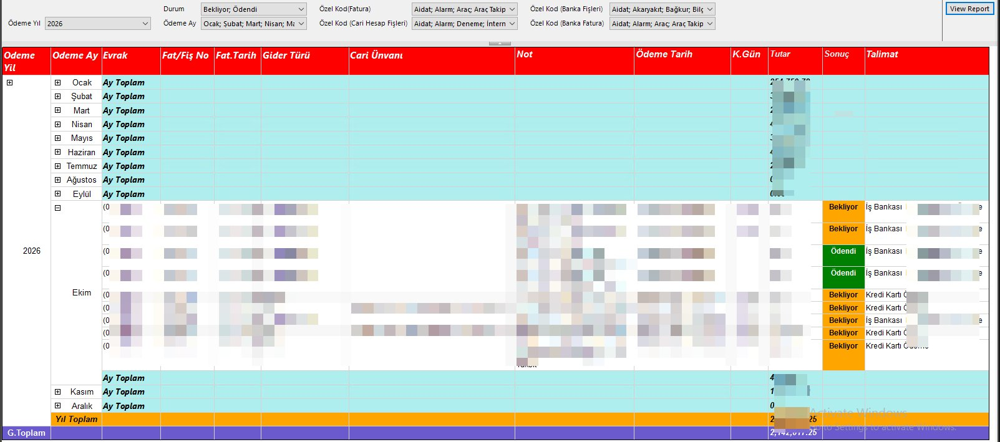

# Gider Tablosu Raporu

Logo Tiger ERP üzerinde aylık gider takibi yapan SSRS raporu. Ödeme durumu, gider türü ve cari bazında detaylı filtreleme destekler.

## Önizleme

## Özellikler

- Yıl ve ay bazında gruplandırma, ay toplamları ve yıl toplamı
- Ödeme durumu renk kodlaması (Bekliyor / Ödendi)
- Drill-down ile ay detayına inme
- Çoklu parametre filtresi

## Parametreler

| Parametre | Açıklama |
|-----------|----------|
| Ödeme Yılı | Rapor yılı |
| Ödeme Ay | Tek veya çoklu ay seçimi |
| Durum | Bekliyor / Ödendi / Tümü |
| Özel Kod (Fatura) | Fatura bazında gider kategorisi |
| Özel Kod (Banka Fişleri) | Banka fişi bazında gider kategorisi |
| Özel Kod (Cari Hesap Fişleri) | Cari hesap fişi bazında kategori |
| Özel Kod (Banka Fatura) | Banka fatura bazında kategori |

## Sütunlar

| Sütun | Açıklama |
|-------|----------|
| Ödeme Yıl / Ay | Dönem |
| Evrak | Evrak tipi |
| Fat/Fiş No | Fatura veya fiş numarası |
| Fat. Tarih | Fatura tarihi |
| Gider Türü | Gider kategorisi |
| Cari Ünvanı | Tedarikçi adı |
| Not | Açıklama notu |
| Ödeme Tarih | Ödeme yapılan tarih |
| K.Gün | Kalan gün |
| Tutar | Gider tutarı |
| Sonuç | Ödeme durumu (Bekliyor / Ödendi) |
| Talimat | Ödeme talimatı bilgisi |

## Ortam

- **ERP:** Logo Tiger 3
- **Raporlama:** SSRS (SQL Server Reporting Services)
- **Veritabanı:** SQL Server
