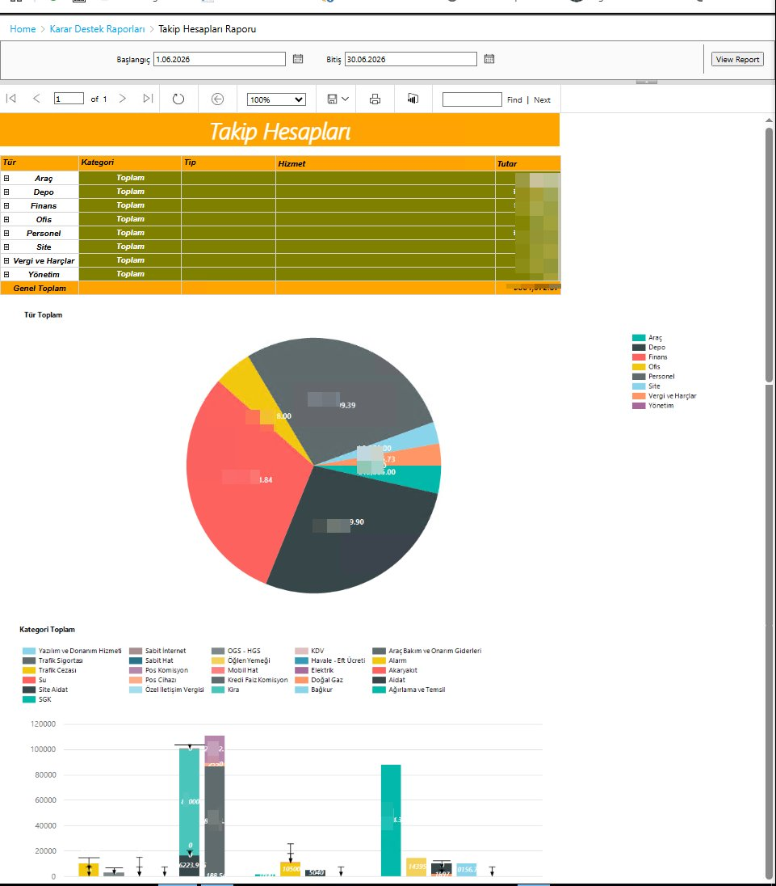

# Takip Hesapları Raporu

Logo Tiger ERP üzerinde giderleri tür ve kategori bazında analiz eden SSRS raporu. Tablo görünümüne ek olarak pasta grafik ve bar grafik ile görsel analiz sunar.

## Önizleme

## Özellikler

- Tür ve kategori bazında hiyerarşik tablo
- Drill-down ile alt kırılımlara inme
- Pasta grafik ile tür bazında gider dağılımı
- Bar grafik ile kategori bazında karşılaştırma
- Tarih aralığı filtresi

## Parametreler

| Parametre | Açıklama |
|-----------|----------|
| Başlangıç | Dönem başlangıç tarihi |
| Bitiş | Dönem bitiş tarihi |

## Gider Türleri

| Tür | Açıklama |
|-----|----------|
| Araç | Araç bakım, sigorta, yakıt giderleri |
| Depo | Depo ve lojistik giderleri |
| Finans | Banka komisyonları, faiz giderleri |
| Ofis | Ofis malzeme ve kira giderleri |
| Personel | SGK, maaş ve özlük giderleri |
| Site | Site aidat ve ortak alan giderleri |
| Vergi ve Harçlar | KDV, trafik cezası, harçlar |
| Yönetim | Yönetim ve temsil giderleri |

## Kategori Örnekleri

Yazılım ve Donanım Hizmeti, Trafik Sigortası, Trafik Cezası, Su, Site Aidat, SGK, Sabit İnternet, Sabit Hat, Pos Komisyon, Pos Cihazı, Özel İletişim Vergisi, OGS-HGS, Öğlen Yemeği, Mobil Hat, Kredi Faiz Komisyon, Kira, KDV, Havale-EFT Ücreti, Elektrik, Doğal Gaz, Bağkur, Araç Bakım ve Onarım Giderleri, Alarm, Akaryakıt, Aidat, Ağırlama ve Temsil

## Ortam

- **ERP:** Logo Tiger 3
- **Raporlama:** SSRS (SQL Server Reporting Services)
- **Veritabanı:** SQL Server
